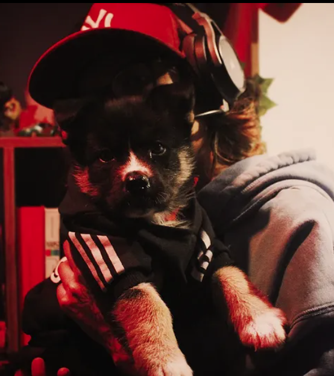

<div align="center">

# ✦ Larycronx — Portfólio

### Interfaces para ideias que merecem ganhar forma.

<p>
<a href="https://larycronx-dev.netlify.app/">Visitar o site</a>
  ·
  <a href="https://github.com/Larycronx">Meu GitHub</a>
  ·
  <a href="https://www.linkedin.com/in/larissafrancisco07/">LinkedIn</a>
</p> 

> Um pequeno caos bem acompanhado — entre código, narrativa e imaginação.

</div>

---

## Sobre este projeto

Este repositório reúne o código-fonte do meu portfólio pessoal. O site apresenta projetos, experimentos visuais e estudos que atravessam desenvolvimento web, modelagem de dados e criação de experiências para mundos digitais.

Meu trabalho procura aproximar **lógica e imaginação**. Uma interface pode tornar uma ideia complexa mais simples, enquanto um sistema bem estruturado também pode contar uma história.

## Acesse o portfólio

<div align="center">

## [larycronx-dev.netlify.app](https://larycronx-dev.netlify.app/)

</div>

No site, você pode conhecer minha apresentação, explorar os projetos selecionados e entrar no universo de RPG com as páginas de personagens e campanhas.

## Projetos em destaque

### Sistema de Alquimia

Um módulo autônomo para **Foundry Virtual Tabletop v13** e **D&D 5e**. O sistema trabalha com conhecimento individual, experimentação de ingredientes, descoberta de receitas e produção de poções.

- **Tecnologia:** JavaScript

- **Projeto:** [Larycronx/alchemy-system](https://github.com/Larycronx/alchemy-system)

### DER — Gestão Comercial

Modelo relacional para uma empresa de moda automotiva e streetwear. O projeto representa processos de compras, vendas, estoque, clientes, eventos e contas a pagar.

- **Tecnologia:** Mermaid

- **Projeto:** [Larycronx/Der_Banco_De_Dados](https://github.com/Larycronx/Der_Banco_De_Dados)

### Som das Seis

Experiência audiovisual com atmosfera de faroeste fantástico. A página apresenta personagens, trilha sonora e uma narrativa visual inspirada em carinho, liberdade, esperança, loucura e obstinação.

- **Tecnologias:** HTML, CSS e áudio

- **Experiência:** [Abrir Som das Seis](https://larycronx-dev.netlify.app/som-das-seis/som-das-seis)

### Sylkirum — Personagens

Uma página narrativa dedicada a Makiza e Lizel, duas personagens de uma campanha de RPG. A experiência combina ilustração, descrição de personagens, trilha ambiente e fichas individuais.

- **Página:** [Abrir personagens](https://larycronx-dev.netlify.app/personagens.html)

- **Ficha de Makiza:** [Abrir ficha](https://larycronx-dev.netlify.app/personagens/makiza.html)

- **Ficha de Lizel:** [Abrir ficha](https://larycronx-dev.netlify.app/personagens/lizel.html)

## Tecnologias e recursos

<div align="center">


</div>

O projeto utiliza HTML semântico, CSS responsivo, JavaScript para interações e áudio ambiente, imagens ilustrativas e publicação contínua pelo Netlify.

## Estrutura do repositório

```
.
├── assets/                    # Imagens e artes principais do portfólio
├── personagens/               # Fichas individuais de Makiza e Lizel
├── som-das-seis/              # Página e recursos da campanha Som das Seis
├── Music/                    # Trilhas sonoras do universo de RPG
├── Fonte/                    # Fonte usada na identidade visual
├── index.html                # Página inicial do portfólio
├── rpg.html                  # Entrada para o universo de RPG
├── personagens.html          # Página principal de personagens
├── styles.css                # Estilos globais e responsivos
└── README.md                 # Documentação do projeto
```

## Como visualizar localmente

Clone o repositório e abra a pasta do projeto:

```bash
git clone https://github.com/Larycronx/portifolio-26.git
cd portifolio-26
```

Como o projeto utiliza arquivos locais, a forma mais segura de visualizá-lo é iniciar um servidor HTTP simples. Com Python instalado, execute:

```bash
python -m http.server 8000
```

Depois, acesse [http://localhost:8000](http://localhost:8000) no navegador.

## Publicação

O site está publicado no Netlify. As alterações podem ser versionadas neste repositório e publicadas a partir da integração configurada na plataforma.

> Para uma melhor experiência, abra o site em uma tela grande ou em um celular. As páginas de personagens possuem layouts adaptados para toque e leitura em telas menores.

## Contato

Se quiser conversar sobre projetos, interfaces, RPG ou experimentos criativos:

- [LinkedIn — Larissa Francisco](https://www.linkedin.com/in/larissafrancisco07/)

- [GitHub — Larycronx](https://github.com/Larycronx)

- [Portfólio — larycronx-dev.netlify.app](https://larycronx-dev.netlify.app/)

---

<div align="center">

**Larissa Francisco / Larycronx**

Feito com curiosidade, código e um pouco de caos.

</div>

[site]: https://larycronx-dev.netlify.app/ "Portfólio Larycronx"

[github]: https://github.com/Larycronx "GitHub Larycronx"

[linkedin]: https://www.linkedin.com/in/larissafrancisco07/ "LinkedIn de Larissa Francisco"
